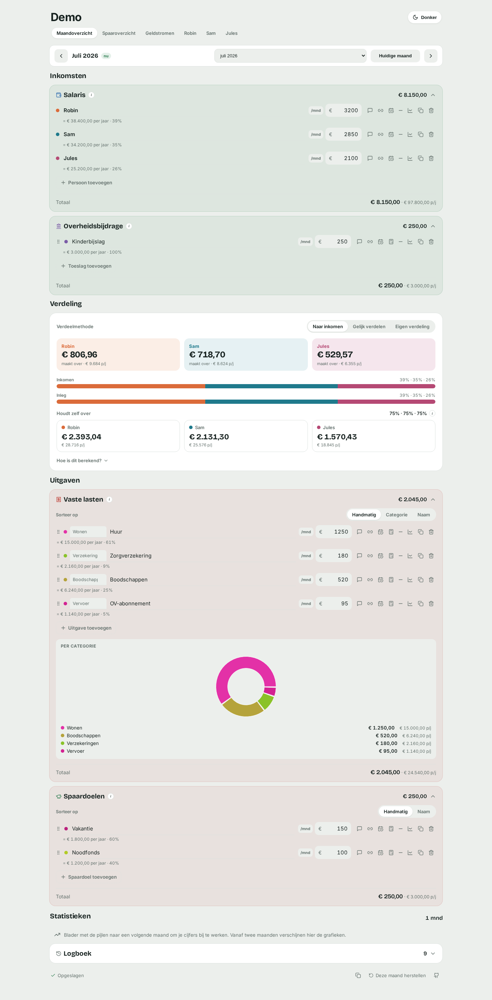
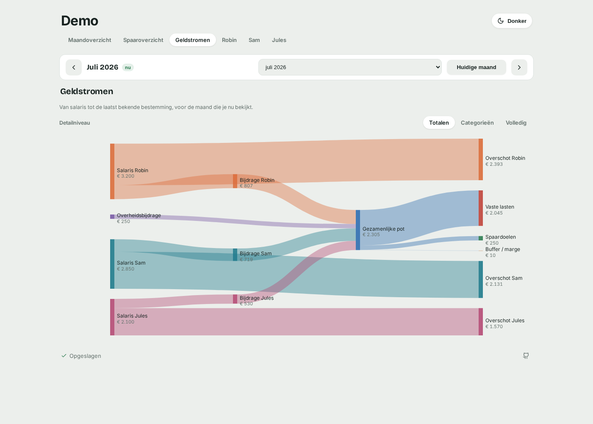
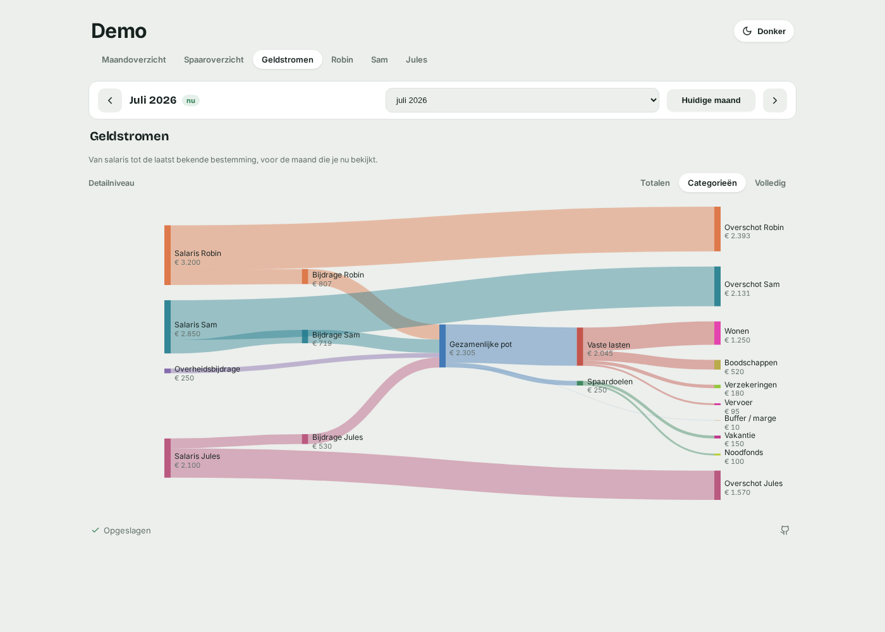
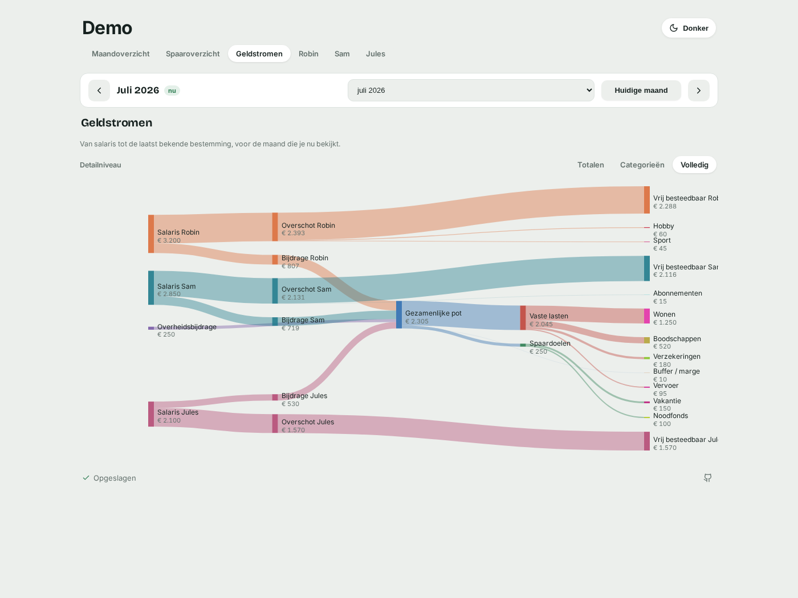
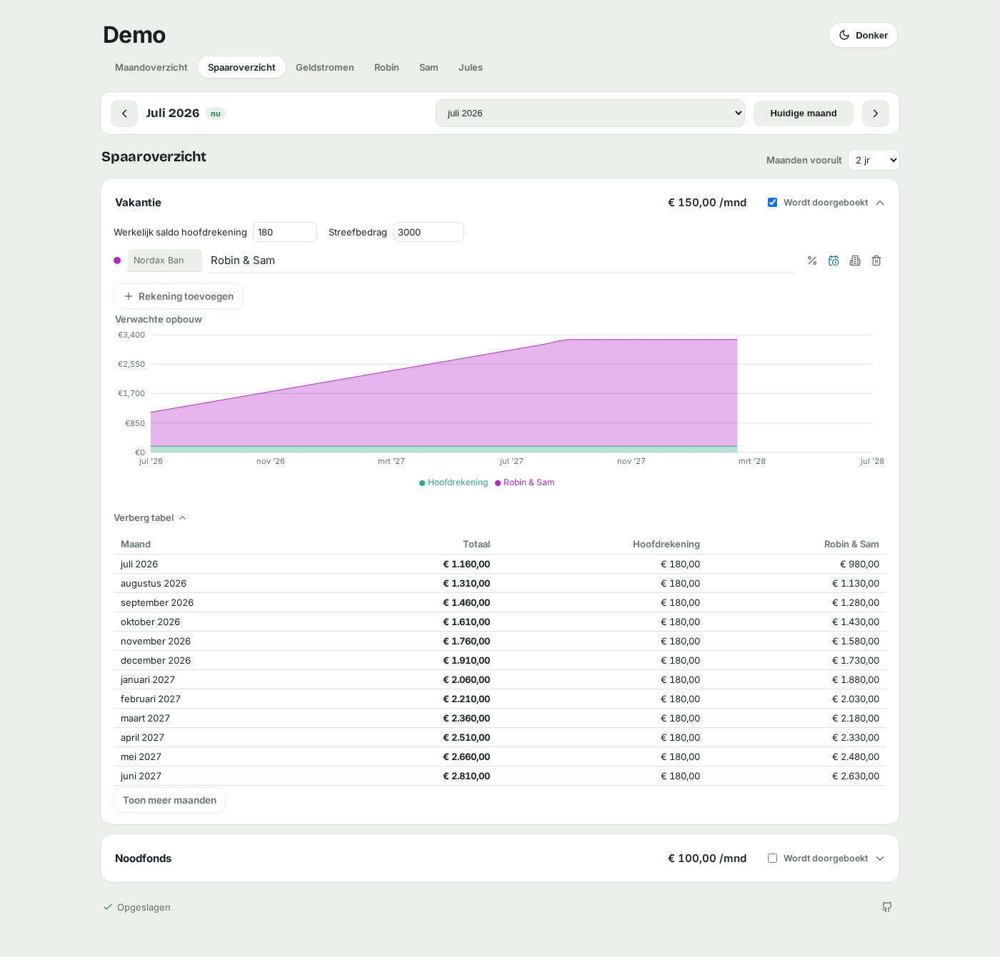
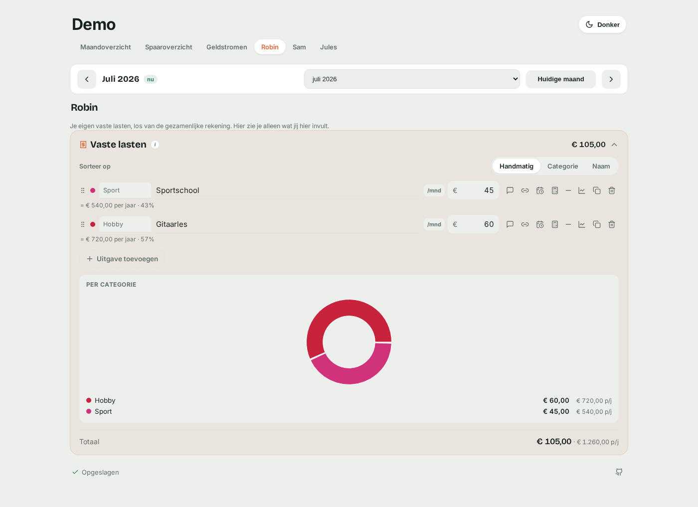
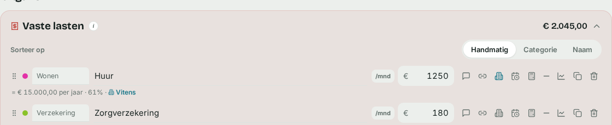
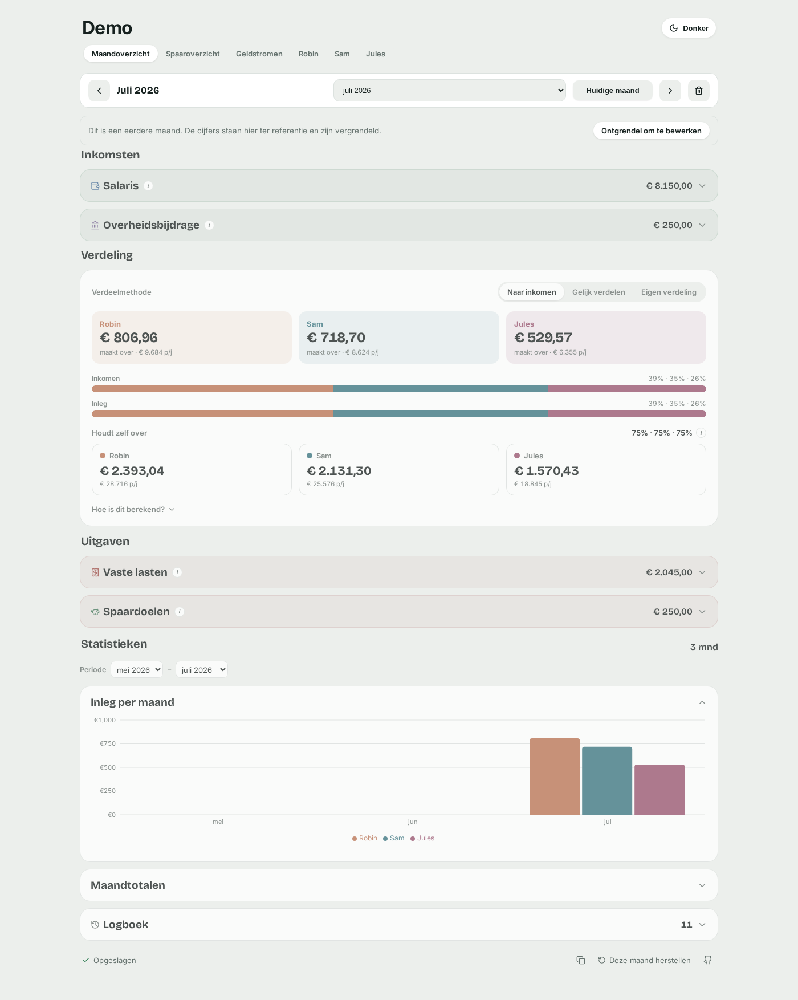
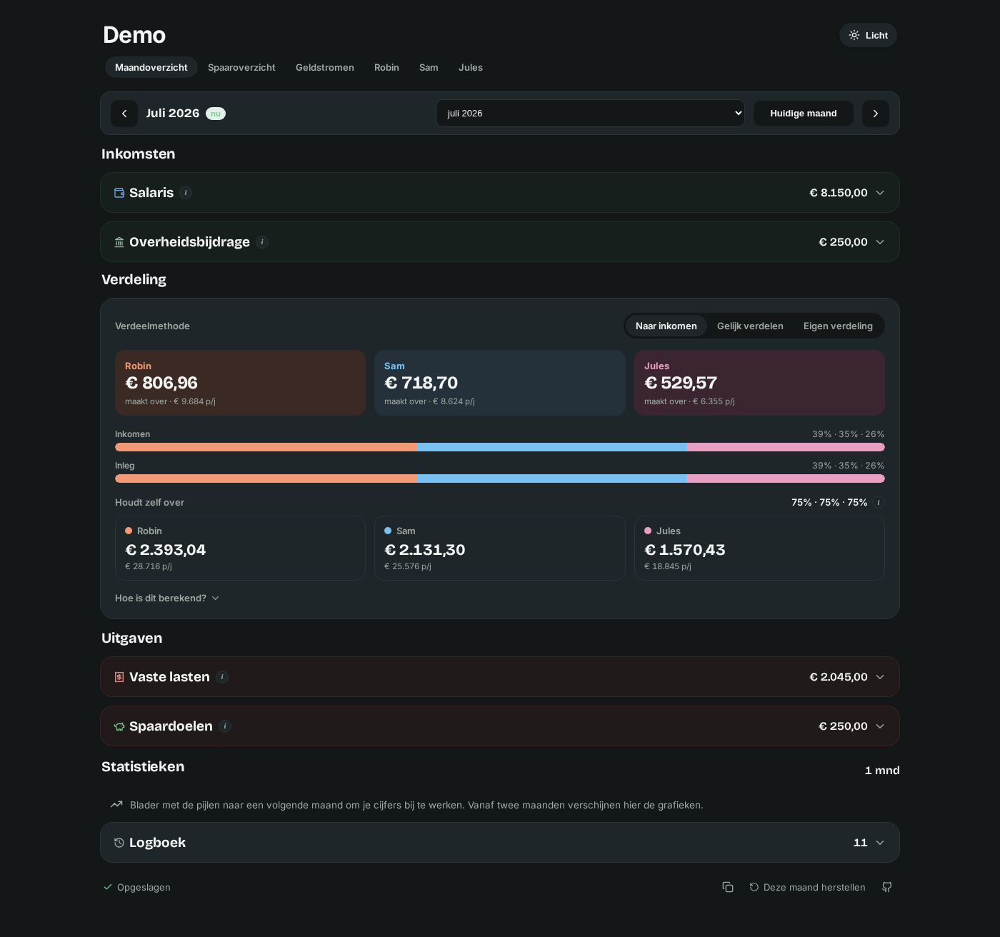

# Open Family Finance

*Read this in other languages: [Nederlands](README.nl.md)*

Open Family Finance is a self-hosted web app for any number of people —
couples, families, housemates — who each keep a personal account, plus one
shared account for joint costs. It gives you insight into what comes in and
goes out, and calculates a fair monthly transfer from each personal account
to the shared account.

## The idea

- Everyone enters their own **net income**.
- You track **shared expenses** (rent, groceries, insurance, ...), **savings
  goals**, and any **government support** you receive (e.g. child benefit)
  that reduces what you need to contribute yourselves.
- The app works out `expenses + savings − government support` = what you need
  to finance together, and splits that amount using one of three methods:
  - **By income** — whoever earns more contributes proportionally more, so
    that after the transfer everyone keeps the same *percentage* of their own
    salary.
  - **50 / 50** (or an even split across however many people there are) —
    split the shared amount evenly, regardless of income.
  - **Custom split** — set your own percentage per person if neither of the
    above fits your situation.
- A small configurable **buffer margin** (%) is added on top of each transfer,
  so the shared account keeps a cushion instead of running exactly to zero.

Everything is entered and viewed **per month**, so you can track how the
numbers evolve over time.

## Features

- **Any number of people** — not just two. Add as many as your household
  needs, each with their own name, color and income.
- **Fair-split calculator** — by income share, an even split, or your own
  custom percentage per person, with a configurable safety buffer, and a
  breakdown of exactly how each number was calculated.
- **Monthly tracking with forward propagation** — an edit to an entry applies
  to the current month and every future month, until that entry is edited
  again in one of those months (which "pins" it there). Past months are never
  changed automatically.
- **Income, government support, expenses and savings**, each as separate line
  items with a category (expenses), an optional note, and an optional link
  (e.g. to a bill or contract).
- **Linked/formula entries** — derive one entry's amount from another (e.g.
  "gross salary minus pension contribution"), with a chain of operations
  (plus / minus / times / divide).
- **Trend indicators & history sparkline** per entry, comparing the current
  month to the most recent earlier month with a value.
- **Copy tools** — copy a single entry's amount to other months, or copy an
  entire month's figures to earlier months.
- **Change log** — every edit is recorded with date, time, old and new value.
- **Statistics** — bar chart of each person's monthly contribution, a bar
  chart of income / government support / expenses / savings per month, and a
  pie chart of expenses by category. All charts can be limited to a custom
  date range (defaults to all months), and each chart can be collapsed on its
  own.
- **Sorting** — sort expenses, government support and savings by name (and
  expenses additionally by category), or drag-and-drop your own manual order.
- **Contract duration** — give any entry a start and end date to track a
  contract or subscription term, with a progress bar and a color-coded
  warning once it's ending soon (within 30 days by default, adjustable per
  entry) or has already expired.
- **Personal expense pages** — a page per person for their own fixed costs,
  kept separate from the shared account, in that person's own color.
- **Savings goals with a running balance** — a projected-growth chart per
  goal, an actual monthly balance you can correct at any point (earlier
  months stay exactly as recorded), an optional target amount that caps the
  projection once reached, and an optional split across several sub-accounts
  at different banks, each with its own balance and interest rate.
- **Cashflow diagram** — a Sankey diagram tracing money from salary to its
  last known destination, for whichever month you're viewing, with three
  levels of detail: totals only, plus categories and savings goals, or the
  full breakdown including personal spending.
- **Locked history** — past months are greyed out and read-only by default,
  so you can't edit them by accident; unlock a specific past month explicitly
  if you really need to correct it.
- **Correspondents stand out inline** — wherever you've set one, it's shown
  right in the entry line (not just tucked away in a popover).
- **Light and dark theme.**
- **Dutch and English UI**, selectable via an environment variable.
- **Optional paperless-ngx integration** — pick a correspondent from your
  paperless instance on expenses, government support and savings entries, or
  just type your own, and jump straight to the most recent document paperless
  has for it. See [Paperless-ngx integration](#paperless-ngx-integration).
- **Self-hosted**: a small Express API backed by Postgres, with an optional
  bearer-token to lock down access.

## Screenshots

All figures shown below are made-up placeholder data.

**Monthly overview** — income, distribution, expenses and savings for the
month you're viewing.



**Cashflow** — a Sankey diagram from salary to its last known destination,
at each of the three detail levels.





**Savings goals** — a projected balance per goal, split across sub-accounts
at different banks.



**Personal expenses** — a page per person for costs that stay off the shared
account.



**Correspondents stand out inline.**



**Locked history** — past months are greyed out and read-only until
explicitly unlocked.



**Dark theme.**



## Getting started

The quickest way to run the full stack (database + API + frontend) locally is
with Docker Compose:

```sh
cp .env.example .env
# edit .env if you want to change the database credentials, or set an
# API_TOKEN / LANGUAGE / APP_TITLE — see "Configuration" below
docker compose up --build
```

The app is then available at <http://localhost:8080>.

### Local development (without Docker)

```sh
# backend
cd backend && npm install && npm run dev   # http://localhost:8080

# frontend, in a separate terminal
cd frontend && npm install && npm run dev  # http://localhost:5173, proxies /api to the backend
```

## Configuration

All configuration is done through environment variables — see
[`.env.example`](.env.example) for the full list used by Docker Compose:

| Variable            | Default                | Description |
|----------------------|-------------------------|-------------|
| `POSTGRES_USER`       | —                        | Postgres username |
| `POSTGRES_PASSWORD`   | —                        | Postgres password |
| `POSTGRES_DB`         | —                        | Postgres database name |
| `API_TOKEN`           | *(unset = API is open)* | Optional bearer token required on every `/api` request, shared between the frontend and backend |
| `LANGUAGE`            | `nl`                     | UI language: `nl` or `en` |
| `APP_TITLE`           | `Open Family Finance`    | Page title / heading shown in the app |
| `PAPERLESS_ENABLED`   | `false`                  | Turns the paperless-ngx correspondent integration on, both the backend proxy and the frontend UI (see below) |
| `PAPERLESS_URL`       | —                        | Base URL the **backend** uses to call the paperless API. Backend-only, used only when `PAPERLESS_ENABLED=true` |
| `PAPERLESS_PUBLIC_URL`| *(falls back to `PAPERLESS_URL`)* | Base URL used to build "open in paperless" links. Only set this if paperless is reachable at a different address from your browser than `PAPERLESS_URL` (e.g. `PAPERLESS_URL` is a cluster-internal address) |
| `PAPERLESS_API_TOKEN` | —                        | paperless-ngx API token. Backend-only, never sent to the browser |
| `PAPERLESS_DOCUMENT_TYPE_PRIORITY` | —           | Optional, comma-separated document type names in priority order (e.g. `Jaaropgave,Jaarafrekening,Factuur,Contract`). The linked document becomes the most recent one of the first type in this list the correspondent has, instead of just the most recent overall. Backend-only |

`LANGUAGE`, `APP_TITLE` and `PAPERLESS_ENABLED` are read by the frontend at
container start (not baked into the build), so the same image can be reused
for different deployments.

## Paperless-ngx integration

If you run [paperless-ngx](https://docs.paperless-ngx.com/) and want your
correspondents (the companies/senders on your documents) available while
entering expenses, government support or savings:

1. Generate an API token in paperless-ngx (user profile → API token).
2. Set `PAPERLESS_ENABLED=true`, `PAPERLESS_URL` and `PAPERLESS_API_TOKEN`
   (and `PAPERLESS_PUBLIC_URL`, if paperless is reachable at a different
   address from your browser) for the **backend**, and `PAPERLESS_ENABLED=true`
   for the **frontend** — see [Configuration](#configuration).
3. A correspondent icon appears in the action row of expenses, government
   support and savings entries — it's collapsed by default so entries that
   don't need one stay uncluttered. Clicking it opens a field that suggests
   names from paperless as you type, while still accepting anything you type
   yourself. A name that doesn't exist yet in paperless is created there too,
   so the two stay in sync.
4. If the typed name matches a known paperless correspondent, the same popover
   shows the most recent document paperless has for it (if any), with a link
   to open it directly in paperless. Set `PAPERLESS_DOCUMENT_TYPE_PRIORITY` to
   prefer certain document types (e.g. an annual statement or invoice) over
   just whatever is most recent overall.

The frontend never talks to paperless directly and never receives
`PAPERLESS_URL`, `PAPERLESS_PUBLIC_URL` or `PAPERLESS_API_TOKEN` — all
communication goes through the backend API. Leaving `PAPERLESS_ENABLED` unset
(or `false`) hides the correspondent field entirely; nothing paperless-related
is shown or fetched.

## Data & privacy

All figures are stored as a single JSON blob in your own Postgres database via
the bundled API — nothing is sent to any third party. Real amounts never live
in this repository, which is why it can be public.

## Project status

This project is under active development and **not yet production-ready**:
features may be incomplete, breaking changes can happen without notice, and
you should expect the occasional bug. Contributions, bug reports and feedback
are welcome.

## License

Apache License 2.0 — see [`LICENSE`](LICENSE).
